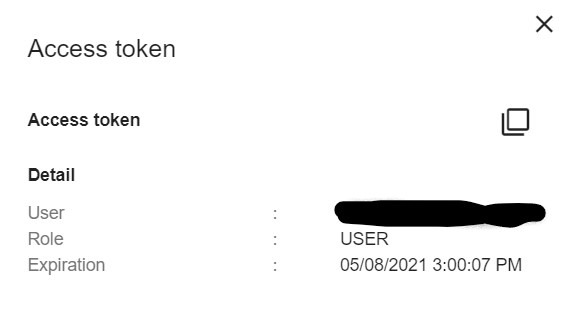
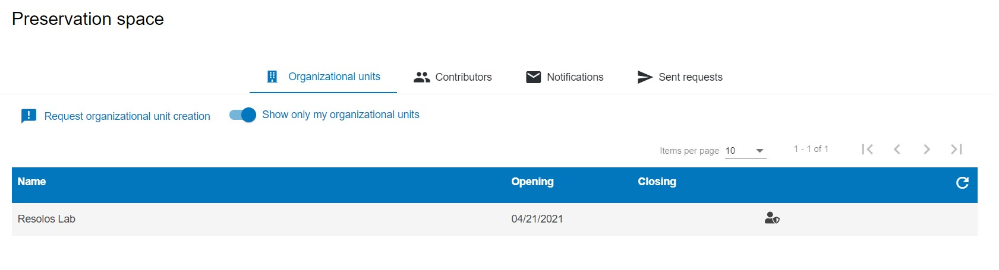
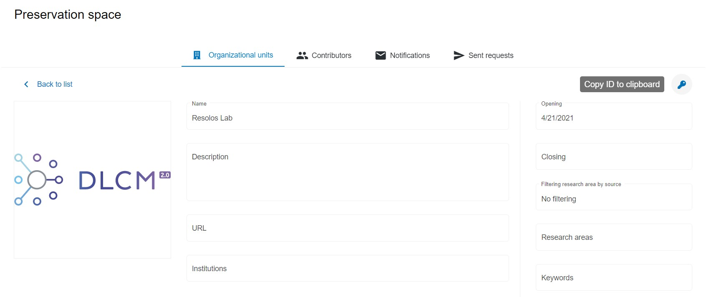
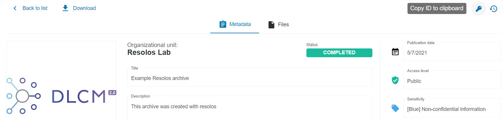

# Archival

Resolos is capable of archiving projects and loading them on other machines. The archive contains all the data
present in the project folder in a compressed format, plus information on the conda environment needed for 
reproducing it somewhere else.

> Migrating environments between different machines is a difficult task, and the more customization a conda 
> environment has, the harder it is to replicate it on a different machine. For example, if your code relies on a 
> propriatery software that is only available for Windows, then there is no way to exactly replicate that environment on Linux
> or macOS. The rule of thumb is that as long as you install all of your dependencies via conda (and pip), you'll have a good
> change of replicability on different OSes. 
>

Resolos currently supports 3 types of storage backends for archival: 
local files, public URLs and [Yareta deposits](https://yareta.unige.ch/).

## Local files

### Creating an archive

You can create a new archive file with the `r3s archive create` command:

```
r3s archive create -f ../my_archive_name.tar.gz
```

The archive should not be created inside the project itself, and it can take a couple of minutes until the environment
is scanned and exported. Once finished, you can publish the archive file and then other users will be able to load your 
environment with resolos easily.

### Loading an archive

You can initialize new projects from an archive file:

```
r3s init -f ../my_archive_name.tar.gz
```

## Public URLs

### Creating archives

Resolos currently does not support uploading to URL locations directly. Please create a local file first,
and use your favourite tool to upload it.

### Loading an archive

You can initialize new projects from archive URLs directly:

```
r3s init -u https://my-storage-service.org/my_archive_name.tar.gz
```


You can also load an archive from an existing project. Note that this'll overwrite the contents of
the project folder and the conda environment!

```
r3s archive load -u https://my-storage-service.org/my_archive_name.tar.gz
```


## Yareta

Resolos supports direct interaction with Unige's long-term archival solution [Yareta](https://yareta.unige.ch/).
You can directly create and load Yareta deposits with Resolos.

### Prerequisites

First you need to get a valid Yareta access token. The easiest way is to log in at the [portal](https://yareta.unige.ch/)
, and go to Account/Token at the top right corner:



Copy the access token to the clipboard, and export it in the shell where you'll use Resolos:

```
export YARETA_ACCESS_TOKEN=<access_token>
```

### Creating an archive

To be able to create Yareta deposits, you'll need to be a member of an Organizational Unit with the appropriate access rights.
To find your organizational unit(s), click **Preservation Space** on the top menu bar on the portal, 
and turn on the **Show only my organizational units** toggle.



Open the desired Organizational Unit, and use the key symbol on the right to copy its ID to the clipboard:



Now you can create the achive with 

```
r3s archive create -o <org_unit_id> --title "..." --year "..." --description "..." ...
```

Resolos will log the deposit ID of the created deposit. You may use that deposit ID to
share your archive with others.

For all available options, check the [command reference](commands.md).


### Loading an archive

You can initialize new projects from an archive directly. First you need to get the ID of the 
Yarete deposit that was create using Resolos. You might have that from previous runs, or you
can search for deposits on the portal itself.

Once you've found a deposit created by Resolos on the portal, you can copy its ID using the key symbol to the clipboard.



Then you may initialize a new project from it

```
r3s init -d <deposit_id>
```

or load it to an existing project

```
r3s archive load -d <deposit_id>
```